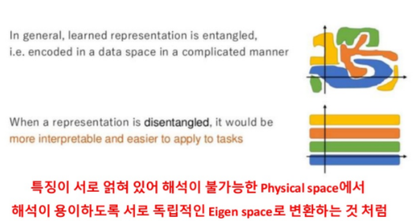
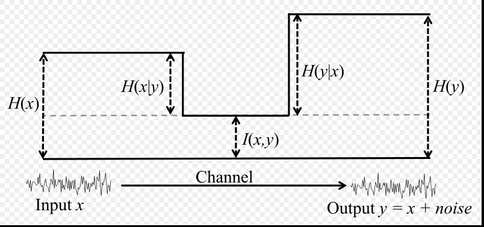
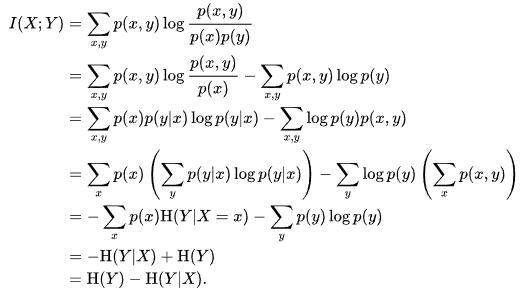

# Infogan
Infogan 수식과 코드구현

Infogan - information theory + gan 
gan은 input(z) vs infogan은 input(z,c) 

c란 latent variable c란 회전 , 두께, etc...로 Z,C 사이에  Mutual Information(MI)를 높이는 방향으로 학습합니다.

# GAN과 InfoGan 차이

gan은 단순히 z만 학습하기 때문에 제약을 받지 않아서 생성되는 모델이 꼬인 형식으로 나올 여지가 있다고 합니다.
이러한 꼬여진 상태보다는 좀 더 꼬이지 않은 방식으로 학습하길 원해서 나온 것이 infogan 이라고 합니다.

(reference: http://jaejunyoo.blogspot.com/2017/03/infogan-1.html)

위에 있는 복잡한 형식에서는 유의미한 c를 찾기가 어려워 보입니다. 하지만 이것을 펼처서 분류해서 볼 수 있다면 

해석이 좀 더 용이해질 것 같습니다. mnist 경우 y축에 따라 (색깔, 굵기 , 기울기, ... etc)와 같이 분류해서 볼 수 있는 형태로 바뀔 것 같습니다.

이런 식으로 해결을 한게 infogan입니다.

# infogan 
infogan은  1. noise인 z와  2. latent code인 c로 나뉘어서 

code c(i) 부분이 (색깔, 굵기 , 기울기, ... etc) 에 대한 부분으로 각각은 독립적인 부분이라 생각하고 factorized distribution으로  나타낼 수 있습니다 .(bayseian network 관련 부분)

기존의 Gan 모델에서  c에 대한 제약이 없기 때문에 G(z,c)이 되어도 P(X | C) = P(X) 가 될 수가 있다. 

왜냐하면 X에 대한 것만 찾으면 되기 때문에 C와 X가 독립이라고 하면은 C는 무시할 수 있게 된다. P(X | C) = P(X,C) / P(C) = [P(X) P(C)]/ P(C) = P(X)

그래서 이러한 것을 막기 위해서 c, G(z,c)의 상호정보량(MI)(I(c; G(z,c))를 높게 유지하게 한다. 
## MI_1

## MI_2

## MI_수식

(reference : https://en.wikipedia.org/wiki/Mutual_information#/media/File:Entropy-mutual-information-relative-entropy-relation-diagram.svg)

I(X;Y) X에서 Y로부터 설명 될 수 있는 정보량 = X가 관측 되었을 때 Y에서 없이지는 불확실성의 입니다. 만약 서로 독립적인 관계라면 I(X;Y)=0입니다.

## MINIMAX_INFOGAN

C에 대해서는 중요한게 담기기를 원하면서 GAN에 대한 구조로 학습을 하게 됩니다.

## Variation Mutual Information Maximization
I(c; G(z,c))를 최대하 하기 위해서는 P(c|G(z,c)) 를 알아야하고 P(G(z,c))는  계산이 불가능하기 때문에 varational information maximization이라는 lower bounding tech을 사용해야합니다.

( 이 부분에서 P(c|G(z,c)) 가  필요하다고 나옴  )

## Infogan 수식 설명

(reference :임성빈님의 facebook 자료 )
=1.PNG)

처음에 수식부분에서 이해가 안되는 부분이 있었지만, 임성빈님께 질문을 하고나서 latent c CODE의 총합은 1이 된다는 것을 알았습니다.
